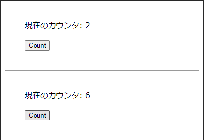
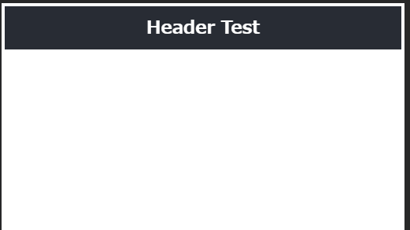
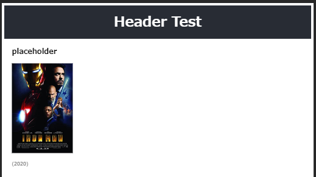

# frontend-tuto

参考: [2020年のフロントエンドマスターになりたければこの9プロジェクトを作れ](https://qiita.com/rana_kualu/items/915345b8f3f870cfe2aa)

## Environment

- OS: Ubuntu 20.04
- Shell: bash
- Editor: VSCode
- Docker: 19.03.12
    - docker-compose: 1.26.0

### Structure
```bash
./ # => service://cli:/work/:rw
|_ package.json # node package management file
|_ n # command alias: docker-compose exec $opt cli $*
|_ Dockerfile # service://cli docker build conf
|_ docker-compose.yml # docker compose
                      # - service://cli <node:12-alpine>
                      #   - $ docker-compose exec [opt] cli <command> ...
                      #   - tcp://localhost:<port> => service://cli:<port>
```

### Setup
```bash
# build docker containers
## create user: worker (in service://cli) => user id: $UID (same with current working user)
$ export UID && docker-compose build

# launch docker containers
## tcp://localhost:<port> => service://cli:<port>
$ docker-compose up -d

# add execution permission to ./n
# ./n: $ docker-compose exec $opt cli $*
$ chmod +x ./n
```

***

## 0. Zero Server

参考: https://zeroserver.io/docs/

### Structure
```bash
./
|_ app/ # main app dir
|  |_ index.jsx # http://localhost:3000/ (React App)
|  |_ time.js # http://localhost:3000/ (Nodejs API)
|
|_ .babelrc # babel conf file
|_ package.json
|_ n
|_ Dockerfile
|_ docker-compose.yml
```

### app/time.js
```javascript
const moment = require("moment")
module.exports = (req, res) => {
  res.send({time: moment().format('LT')})
}
```

### app/index.jsx
```javascript
import React from 'react'
export default class extends React.Component {
  static async getInitialProps(){
    var json = await fetch("/time")
      .then((resp) => resp.json())
      .catch(err => console.log(err))
    return {time: json.time}
  }
  render() {
    return <p>Current time is: {this.props.time}</p>
  }
}
```

### Execution
```bash
# Run zero server in ./app/
$ ./n zero app

# server: http://localhost:3000 => service://cli:3000
```

***

## 1. How to build a movie search app using React Hooks

React + Hook で映画検索アプリを作成する

参考: [How to build a movie search app using React Hooks](https://www.freecodecamp.org/news/how-to-build-a-movie-search-app-using-react-hooks-24eb72ddfaf7/)

### Structure
```bash
./
|_ hooked/
   |_ components/
   |  |_ App.css # main css file
   |  |_ App.jsx # mail react component
   |  |_ Header.jsx # header component
   |  |_ Movie.jsx # movie card component
   |  |_ Search.jsx # search box component
   |
   |_ test/ # for display test
   |  |_ index.jsx # http://localhost:3000/test/
   |
   |_ .babelrc # babel conf file
   |_ index.jsx # http://localhost:3000
```

### Setup

#### .babelrc
```json
{
  "plugins": [
    "babel-plugin-react-require",
    "react-hot-loader/babel",
    "babel-plugin-transform-zero-dirname-filename",
    "@babel/plugin-transform-runtime",
    [
      "@babel/plugin-proposal-class-properties",
      {
        "loose": false
      }
    ]
  ]
}
```

#### launch zero server
```bash
# launch zero server in ./hooked/
# => http://localhost:3000
$ ./n zero hooked
```

### useState | 状態管理
React16.8で追加された「Hooks」を利用して、関数コンポーネントに「state」と「ライフサイクルメソッド」の機能を実装できる

- `useState()` を利用すると、関数コンポーネントの状態管理を実装可能
    - `useState()` の引数にstateの初期値を指定する
    - `useState()` は戻り値として、**state変数** と **stateを更新するための関数** を返す
    - 複数のstateを使うには、複数回 `useState()` を呼ぶ

以下のサンプルコードで、今までの「classコンポーネントを使った状態管理」と「useStateを使った関数コンポーネント内の状態管理」を比較する

```javascript
/**
 * React状態管理
 * @state int count
 * @action button.onclick => count をインクリメント
 * @view p.text: 現在のカウンタ $count
 */
import React, {useState} from 'react';
import {Helmet} from 'react-helmet-async';

/**
 * インラインスタイル
 */
const style = {
  fontSize: '16px',
  margin: '2.4rem auto',
  display: 'block',
  width: '80%',
};

/**
 * classコンポーネント: React.Componentを継承し、renderメソッドでReactDOMを返す
 */
class ClassComponent extends React.Component {
  constructor(props) {
    super(props);
    // state準備
    this.state = {
      count: 0
    };
  }

  // button.onclick 時アクション
  onclick() {
    // stateを更新する場合は setState メソッドを使う
    this.setState({count: this.state.count + 1});
  }

  // 描画
  render() {
    return (
      <div style={style}>
        <p>現在のカウンタ: {this.state.count}</p>
        <button onClick={() => this.onclick()}>Count</button>
      </div>
    );
  }
}

/**
 * 関数コンポーネント: propsを受け取り、ReactDOMを返す
 */
const FuncComponent = () => {
  /**
   * useState(初期値) => 状態, 状態更新関数（フック）
   */
  const [count, setCount] = useState(0);

  // button.onclick 時アクション
  const onclick = () => {
    setCount(count + 1);
  }

  return (
    <div style={style}>
      <p>現在のカウンタ: {count}</p>
      <button onClick={onclick}>Count</button>
    </div>
  );
}

export default (props) => {
  // react-helmetでmetaタグ設定可能
  return (
    <section>
      <Helmet>
        <meta charSet="UTF-8"/>
        <meta name="viewport" content="width=device-width, initial-scale=1"/>
        <title>React状態管理</title>
      </Helmet>
      <ClassComponent />
      <hr/>
      <FuncComponent />
    </section>
  );
}
```



### useEffect | ライフサイクルの代替
- `useEffect()` は、クラスコンポーネントの以下メソッドが持つ役割をまとめたもの
    - `componentDidMount`
    - `componentDidUpdate`
    - `componentWillUnmount`
- `useEffect()` の動作の特徴
    - 第一引数(関数指定)
        - `componentDidMount` `componentDidUpdate` で行っていた処理を指定
        - 関数の戻り値の指定は任意
            - 戻り値で指定した処理がコンポーネントの終了時に実行される
            - (`componentWillUnmount` に相当)
    - 第二引数(配列指定)
        - 第一引数で指定した関数の実行タイミングを調整
        - 指定しない場合
            - **初回レンダー時** と **毎回の更新時** に実行される
        - 空配列で指定した場合 (`[]`)
            - **初回レンダー時** のみ実行される
        - 特定stateを指定した場合 (e.g. `[state1, state3]`)
            - **初回レンダー時** と **指定stateの更新時** に実行される

```javascript
/**
 * React状態更新イベント制御
 * @state array<int> counts
 * @state bool style
 *
 * @action li.onclick => state.[count]++
 * @action button.onclick => state.style != state.style
 * @effect state.style.onupdate => console.log('switched')
 */
import React, {useState, useEffect} from 'react';
import {Helmet} from 'react-helmet-async';

/**
 * インラインスタイル
 */
const div = {
  margin: '3rem auto',
  display: 'block',
  width: '80%',
};
const pointer = {
  cursor: 'pointer'
};
const dark = {
  position: 'absolute',
  width: '95%',
  height: 'auto',
  backgroundColor: '#333',
  color: '#eee',
};
const light = {
  position: 'absolute',
  width: '95%',
  height: 'auto',
  backgroundColor: '#eee',
  color: '#333',
};

/**
 * メイン関数コンポーネント
 */
export default (props) => {
  // state準備
  const [counts, setCounts] = useState([0, 1, 2, 3, 4]);
  const [style, setStyle] = useState(false);

  // li.onclick 時イベント
  const onListClick = (index) => {
    // slice で配列コピー
    const newCounts = counts.slice();
    // 指定indexのカウンタ更新
    newCounts[index]++;
    setCounts(newCounts)
  };

  // button.onclick 時イベント
  const onButtonClick = () => {
    setStyle(!style);
  };

  // style state 更新時実行イベント
  useEffect(() => {
    console.log('switched');
  }, [style]);

  // DOM
  return (
    <section style={style? dark: light}>
      <Helmet>
        <meta charSet="UTF-8"/>
        <meta name="viewport" content="width=device-width, initial-scale=1"/>
        <title>React状態管理 | ライフサイクルの代替</title>
      </Helmet>
      <div style={div}>
        <ul>
          {counts.map((count, index) => {
            return (
              <li key={index} onClick={() => onListClick(index)}>Button {index + 1}: {count}</li>
            )
          })}
        </ul>
      </div>
      <div style={div}>
        <button onClick={() => onButtonClick()}>スタイル切り替え</button>
      </div>
    </section>
  );
};
```


### Header component
```javascript
// hooked/components/Header.jsx
import React from "react";

/**
 * <Header text="ヘッダータイトル" />
 */
const Header = (props) => {
  return (
    <header className="App-header">
      <h2>{props.text}</h2>
    </header>
  );
};
export default Header;
```

```css
/* hooked/components/App.css */
.App-header {
  background-color: #282c34;
  height: 70px;
  display: flex;
  flex-direction: column;
  align-items: center;
  justify-content: center;
  font-size: calc(10px + 2vmin);
  color: white;
  padding: 20px;
  cursor: pointer;
}
```

```javascript
// hooked/test/index.jsx
import React from "react";
import Header from '../components/Header';
import '../components/App.css';

export default class extends React.Component {
  render() {
    return (
      <div>
        <Header text="Header Test" />
      </div>
    );
  }
}
```

http://localhost:3000/test/



### Movie card component
```javascript
// hooked/components/Movie.jsx
import React from "react";

const placeholder =
  "https://m.media-amazon.com/images/M/MV5BMTczNTI2ODUwOF5BMl5BanBnXkFtZTcwMTU0NTIzMw@@._V1_SX300.jpg";

/**
 * <Movie movie={movie} />
 * movie: {Poster: 画像URL, Title: タイトル, Year: 上映年}
 */
const Movie = ({ movie }) => {
  const poster = (movie.Poster === "N/A"? placeholder: movie.Poster);
  return (
    <div className="movie">
      <h2>{movie.Title}</h2>
      <div>
        
      </div>
      <p>({movie.Year})</p>
    </div>
  );
}
export default Movie;
```

```diff
  /* hooked/components/App.css */
  
  /* ... */
  
+ .movie {
+   padding: 5px 25px 10px 25px;
+   max-width: 25%;
+ }
```

```diff
  import React from "react";
  import '../components/App.css';
  import Header from '../components/Header';
+ import Movie from '../components/Movie';
  
  export default class extends React.Component {
    render() {
      return (
        <div>
          <Header text="Header Test" />
+         <Movie movie={{Poster: 'N/A', Title: 'placeholder', Year: '2020'}} />
        </div>
      );
    }
  }
```

http://localhost:3000/test/


