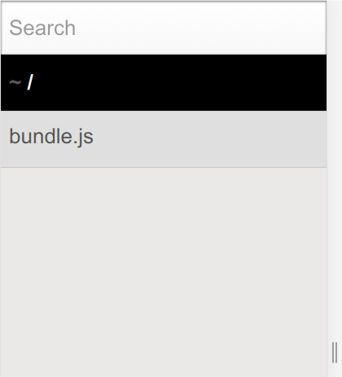

# React｜チュートリアル

## Environment

- OS: Ubuntu 18.04
- CLI:
    - nodejs: `10.15.3`
        - n (バージョン管理ツール): `4.1.0`
        - yarn (パッケージマネージャ): `1.16.0`
        - webpack (モジュールハンドラー): `4.35.0`
            - webpack-cli: `3.3.4`
            - webpack-dev-server: `3.7.2`
- Framework:
    - React: `3.0.1`

***

## Setup (0.25H)

### Install CLI Tools
```bash
# install nodejs
$ sudo apt install -y nodejs npm
$ sudo npm install -g n # Install n-install on global
$ sudo n stable # Install stable nodejs by using n-install
$ sudo apt purge -y nodejs npm # Remove old nodejs and npm
$ sudo apt autoremove -y

# install yarn on global
$ sudo bpm install -g yarn

# show versions
$ n --version
4.1.0

$ nodejs -v
10.15.3

$ yarn -v
1.16.0
```

***

## webpack導入 (0.25H)

### What's webpack?
- 複数のJavaScriptを1つにまとめることが可能
    - JS以外にも、CSSや画像もバンドル可能
- JavaScriptの元々の機能にはないモジュール機能を提供
    - 標準仕様(ECMAScript)の ES Modules が使用可能
    - node_modulesのモジュールを結合可能
- プラグインを使うことで、SassをコンパイルしたりAltJSをトランスコンパイルしたりすることも可能

---

### Install webpack
```bash
# install webpack, webpack-cli on local
$ yarn add -D webpack webpack-cli
```

---

### Configure webpack
`webpack.config.js`を作成し、以下のように設定する

```javascript
const path = require('path');

module.exports = {
    // 実行モード: develop => 開発, production => 本番
    // webpack4系以降はmodeを指定しないと警告が出る
    mode: 'development',
    // エントリーポイント
    entry: './src/index.js',
    // 出力設定
    output: {
        // バンドル後のファイル名
        filename: 'bundle.js',
        // 出力先のパス（※絶対パスで指定すること）
        path: path.join(__dirname, 'public')
    }
};
```

---

### Get started
動作確認のため、エントリーポイントに設定した`src/index.js`と、モジュール用の`src/mylib.js`を作成する

- **src/index.js**
    ```javascript
    // モジュール機能を使い mylib.js を読み込む
    import { hello } from "./mylib";

    // mylib.jsに定義されたJavaScriptを実行
    hello();
    ```
- **src/mylib.js**
    ```javascript
    // export文を使ってhello関数を定義
    export function hello() {
        alert("こんにちは！webpack");
    }
    ```

webpackでバンドルする

```bash
$ yarn webpack
# => src/index.js がトランスコンパイルされ public/bundle.js にバンドルされる
```

***

## webpack開発サーバー導入 (0.25H)

### Install webpack-dev-server
```bash
$ yarn add -D webpack-dev-server
```

---

### Configure webpack-dev-server
`webpack.config.js`に開発サーバーの設定を追加し、`package.json`にサーバー起動用のスクリプトを追加する

- **webpack.config.js**
    ```javascript
    module.exports = {
        // 〜省略〜
        // 開発サーバー設定
        devServer: {
            // 起点ディレクトリを public/ に設定
            contentBase: path.join(__dirname, 'public'),
            // ポートを3000に設定
            port: 3000,
            // ブラウザを自動的に開く
            open: true
        }
    };
    ```
- **package.json**
    ```json
    {
        // 〜省略〜
        "scripts": {
            // 開発サーバー起動スクリプト
            "start": "webpack-dev-server"
        }
    }
    ```

---

### Run webpack-dev-server
```bash
# execute `start` script
## => webpack-dev-server
$ yarn start

# => http://localhost:3000 で開発サーバー実行
```



***

## React導入 (0.25H)

### Create React Project

```bash
# create react project into `app` directory
## yarn add g create-react-app && yarn create-react-app app
$ yarn create react-app app
```

***

## Tutorial

参考: https://ja.reactjs.org/tutorial/tutorial.html

### 準備 (0.25H)
チュートリアル用のスタイルシートやスクリプトを準備する

```bash
# プロジェクトに移動
$ cd app

# srcディレクトリを clean up
$ rm -f src/*
```

#### 作成｜スタイルシート: src/index.css
```css
body {
    font: 14px "Century Gothic", Futura, sans-serif;
    margin: 20px;
}

ol, ul {
    padding-left: 30px;
}

.board-row:after {
    clear: both;
    content: "";
    display: table;
}

.status {
    margin-bottom: 10px;
}

.square {
    background: #fff;
    border: 1px solid #999;
    float: left;
    font-size: 24px;
    font-weight: bold;
    line-height: 34px;
    height: 34px;
    margin-right: -1px;
    margin-top: -1px;
    padding: 0;
    text-align: center;
    width: 34px;
}

.square:focus {
    outline: none;
}

.kbd-navigation .square:focus {
    background: #ddd;
}

.game {
    display: flex;
    flex-direction: row;
}

.game-info {
    margin-left: 20px;
}
```

#### 作成｜スクリプト: src/index.js
```javascript
import React from 'react';
import ReactDOM from 'react-dom';
import './index.css';

class Square extends React.Component {
    render() {
        return (
            <button className="square">
                {/* TODO */}
            </button>
        );
    }
}

class Board extends React.Component {
    renderSquare(i) {
        return <Square />;
    }

    render() {
        const status = 'Next player: X';

        return (
            <div>
                <div className="status">{status}</div>
                <div className="board-row">
                {this.renderSquare(0)}
                {this.renderSquare(1)}
                {this.renderSquare(2)}
                </div>
                <div className="board-row">
                {this.renderSquare(3)}
                {this.renderSquare(4)}
                {this.renderSquare(5)}
                </div>
                <div className="board-row">
                {this.renderSquare(6)}
                {this.renderSquare(7)}
                {this.renderSquare(8)}
                </div>
            </div>
        );
    }
}

class Game extends React.Component {
    render() {
        return (
        <div className="game">
            <div className="game-board">
            <Board />
            </div>
            <div className="game-info">
            <div>{/* status */}</div>
            <ol>{/* TODO */}</ol>
            </div>
        </div>
        );
    }
}

// ========================================

ReactDOM.render(
    <Game />,
    document.getElementById('root')
);
```

#### 開発サーバー実行
最低限のスタイルシート, スクリプトを準備できたら以下のコマンドで開発サーバーを起動する

```bash
$ yarn start
# => http://localhost:3000 でサーバーが起動する
```


##### Error: ENOSPC: System limit for number of file watchers reached, ...
Unix系OSを使っていると、Reactプロジェクトの開発サーバー実行時に上記のエラーが出ることがある

これはファイル監視の上限を超えている場合に出るエラーらしい

以下のコマンドでファイル監視の上限を引き上げれば上手く行くはず

参考: https://stackoverflow.com/questions/50793920/enospc-error-in-create-react-app

```bash
# ファイル監視の上限を524288にする
$ echo fs.inotify.max_user_watches=524288 | sudo tee -a /etc/sysctl.conf

# /etc/sysctl.conf の設定を再読込
$ sudo sysctl -p
```
