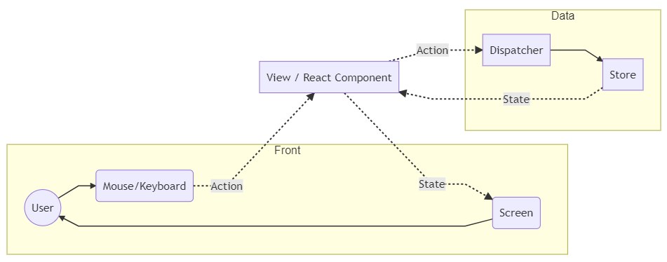

# Redux導入

参考: https://qiita.com/nishina555/items/9ff744a897af8ed1679b

## Introduction

### What's Redux?
Redux
: Fluxの思想を元に作られたJavaScriptアプリの状態管理フレームワーク

---

### Fluxの状態管理モデル
- データの状態は以下のフローに従い一方向に伝搬する
    ```
    Action => Dispatcher => Store => View
    ```
    
- ユーザーの行動によって`View`から`Action`を発行し、データの状態を伝搬させることも可能
    

Action
: データの状態を変更するリクエストを送る

Dispatcher
: Actionからのリクエストを受け取り、Storeにデータを送るサーバーの役割をする

Store
: データの状態を保持しておくデータベースの役割をする

View
: Storeに保持されているデータの状態に従って画面表示を行う

#### FluxとReduxの状態管理モデル比較
- Fluxアーキテクチャ
    
- Reduxアーキテクチャ
    

##### Reducer
- Actionに基づいて新しい状態を返すメソッド
- ReduxにおけるActionはオブジェクトであり、ReducerがActionのロジック部分を担う
    - Action: リクエスト
    - Reducer: ロジック

##### Container
- Reduxで管理されたデータの状態と直接つながっているComponent（View Provider）
- ReduxとReactを繋ぐ橋渡しを行う

***

## 実装準備

### Install
```bash
$ yarn add -D react-redux
```

---

### アーキテクチャ構成
以下のようにディレクトリを構成し、Reduxアーキテクチャの構成を再現する
```python
./
 |- containers/ # [Container]に相当
 |   `- # ReactとReduxを繋ぐ Container Components
 |- components/ # [Presentation]に相当
 |   `- # Viewを担う Presentation Components
 |- actions/ # [Middleware]に相当
 |   |- types.js # Actionの種類を定義
 |   `- index.js # データの状態を変更するリクエストを定義
 |- reducers/ # [Reducer]に相当
 |   `- # Actionに基づいて新しい状態を返す
 `- index.js # エントリーポイント
```

***

## 電卓アプリ作成

### ディレクトリ構成
```python
redux-src/
 |- containers/
 |   `- CalculatorContainer.js
 |- components/
 |   |- NumBtn.js
 |   |- PlusBtn.js
 |   `- Result.js
 |- actions/
 |   |- types.js
 |   `- index.js
 |- reducers/
 |   |- calculator.js
 |   `- index.js
 `- index.js
```
